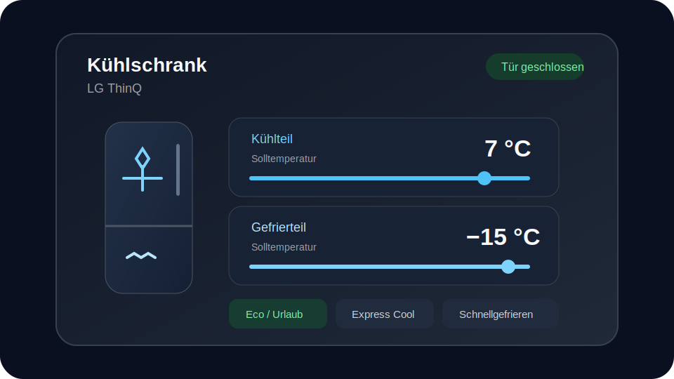

# LG ThinQ Refrigerator Card

A standalone Home Assistant dashboard card for LG ThinQ refrigerators.



## Features

- Automatic LG ThinQ entity discovery from a Home Assistant `device_id`
- Separate refrigerator and freezer target-temperature controls
- Prominent door-open warning
- Eco-friendly and vacation-mode compatibility
- Express Cool and Quick Freeze controls
- Notification banner for relevant LG ThinQ events
- Responsive layout with reduced-motion support
- German and English labels
- No frontend-card dependencies

## Compatibility

This card has been tested with an **LG ThinQ refrigerator** using Home Assistant's official `lg_thinq` integration. It should also work with other LG ThinQ refrigerators that expose the corresponding standard entities. Available controls and status fields depend on the capabilities and enabled entities of the individual appliance.

The following alternative entity suffixes are supported:

- Eco mode: `_eco_friendly` or `_vacation_mode`
- Quick Freeze: `_express_mode`, `_quick_freeze`, `_express_freeze`, `_fast_freeze`, `_schnellgefrieren` or `_schnell_gefrieren`

## Installation

### HACS

1. Open HACS.
2. Add this repository as a custom repository with category **Dashboard**.
3. Install **LG ThinQ Refrigerator Card**.
4. Reload the browser.

HACS installs the resource as:

```text
/hacsfiles/homeassistant_custom_refrigerator_card/homeassistant_custom_refrigerator_card.js
```

### Manual

Copy `dist/homeassistant_custom_refrigerator_card.js` to Home Assistant and register it as a JavaScript module.

## Configuration

```yaml
type: custom:refrigerator-card
device_id: 0123456789abcdef0123456789abcdef
title: Kühlschrank
```

The card discovers the LG ThinQ entities attached to the device. Entity IDs can also be supplied explicitly:

```yaml
type: custom:refrigerator-card
title: Kühlschrank
entities:
  door: binary_sensor.kuhlschrank_door_open
  ecoMode: binary_sensor.kuhlschrank_eco_friendly
  notification: event.kuhlschrank_notification
  freezerTemperature: number.kuhlschrank_freezer_temperature
  fridgeTemperature: number.kuhlschrank_fridge_temperature
  expressCool: switch.kuhlschrank_express_cool
  quickFreeze: switch.kuhlschrank_express_mode
```

Optional settings:

```yaml
type: custom:refrigerator-card
device_id: 0123456789abcdef0123456789abcdef
accent_color: '#4fc3f7'
show_notification: true
show_modes: true
show_temperature_controls: true
```

## Temperature semantics

The number entities exposed by LG ThinQ are treated as **target temperatures**, not independently measured current temperatures. The card therefore labels them as refrigerator and freezer setpoints.

## Notifications

The notification banner is shown only when the event entity has a non-empty `event_type`. Supported labels include:

- frozen process completed
- filter replacement required
- water-filter replacement required
- door open
- filter reset completed

## Development

```bash
npm ci
npm test
npm run build
```

`npm run build` validates the source and writes the HACS distribution file.

## Release process

1. Update `CHANGELOG.md` and the version in `package.json`.
2. Run Jenkins and GitHub Actions validation.
3. Merge the validated version to `main`; the release workflow creates the matching `v<version>` GitHub release and attaches the HACS JavaScript bundle.
4. Confirm that the HACS validation workflow passes.

## Support

Use GitHub Issues for bug reports and feature requests. Security issues should follow [SECURITY.md](SECURITY.md).

## License

MIT
