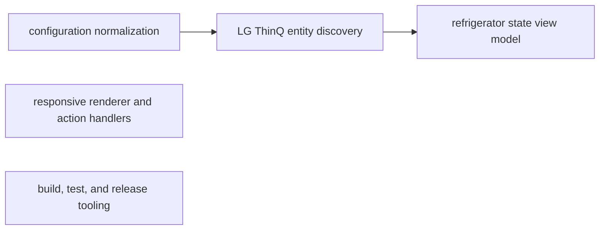

# Container diagram

```mermaid
flowchart LR
    Component1["configuration normalization"]
    Component2["LG ThinQ entity discovery"]
    Component3["refrigerator state view model"]
    Component4["responsive renderer and action handlers"]
    Component5["build, test, and release tooling"]
    Component1 --> Component2
    Component2 --> Component3
```
